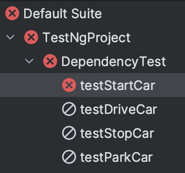

# TestNG 

TestNG - **Test** **N**ext **G**eneration  

### Config file:  
testng.xml is in the project root directory.  
It is a record of the test cases in a test suite.  
You can run the config file in Intellij which triggers the build of the listed tests.  
Can create the file using the Create testNG Plugin.  
```bash
# Execution of the testng.xml file by IDEA:
/Users/legoman/.sdkman/candidates/java/17.0.6-amzn/bin/java \
-ea \
-javaagent:/Applications/IntelliJ IDEA CE.app/Contents/lib/idea_rt.jar=52881:/Applications/IntelliJ IDEA CE.app/Contents/bin \ 
-classpath:/Applications/IntelliJ IDEA CE.app/Contents/lib/idea_rt.jar:/Applications/IntelliJ IDEA CE.app/Contents/plugins/testng/lib/testng-rt.jar:/Users/legoman/code/TestNgProject/target/test-classes:/Users/legoman/code/TestNgProject/target/classes:/Users/legoman/.m2/repository/org/testng/testng/7.10.2/testng-7.10.2.jar:/Users/legoman/.m2/repository/org/slf4j/slf4j-api/1.7.36/slf4j-api-1.7.36.jar:/Users/legoman/.m2/repository/com/beust/jcommander/1.82/jcommander-1.82.jar:/Users/legoman/.m2/repository/org/webjars/jquery/3.7.1/jquery-3.7.1.jar com.intellij.rt.testng.RemoteTestNGStarter \ 
-usedefaultlisteners false \
-listener org.testng.reporters.EmailableReporter2;org.testng.reporters.FailedReporter   
```

### Test Report

**File:** test-output/emailable-report.html  
Test report generated by using the TestNG listeners:
- EmailableReporter2
- FailedReporter

### Annotations
Setup/Teardown Ordering
- @BeforeSuite/@AfterSuite
- @BeforeTest/@AfterTest
- @BeforeClass/@AfterClass
- @BeforeMethod/@AfterMethod

#### Prioritizing annotations
By default, TestNG executes the tests in alphabetical order.  
For example:
1) testFour output
2) testOne output
3) testThree output
4) testTwo output
F -> O -> Th -> Tw

This can be changed by adding priority to the test annotation:  
```java
@Test(priority=0)
```
Lowest priority score will be executed first:
1) testOne output - priority = 0
2) testTwo output - priority = 2
3) testThree output - priority = 3
4) testFour output - priority = 4

#### Disabling annotations
Can disable by adding:  
```java
@Test(enabled = false)
```

### Dependent Tests
If you require a test to execute before another test you can use:
```java
@Test(dependsOnMethods = {"testStartCar"})
public void testDriveCar() {
    System.out.println("Drive car");
}
```
testDrive depends on testStartCar.  
The car needs to be started before it can be driven.  
If the first test fails the others will be ignored:  


### Grouping Tests
Assigning test to the groups called: sanity & regression.
```java
@Test(groups = {"sanity", "regression"})
```
```xml
<suite name="All Test Suite">
    <test verbose="2" preserve-order="true"
          name="/Users/legoman/code/TestNgProject/src/test/java/ie/williamswalsh/GroupingExample.java">
        <groups>
            <run>
                <!--Groups to execute-->
                <include name="sanity" />
                <!-- <include name="regression" />-->
                <!-- Can exclude tests using: -->
                <!-- <exclude name="regression" />-->
            </run>
        </groups>

        <classes>
            <class name="ie.williamswalsh.GroupingExample" />
            <!--Don't use method.include element. Tests are selected by groups.-->
        </classes>
    </test>
</suite>
```


### Assertions
cal]